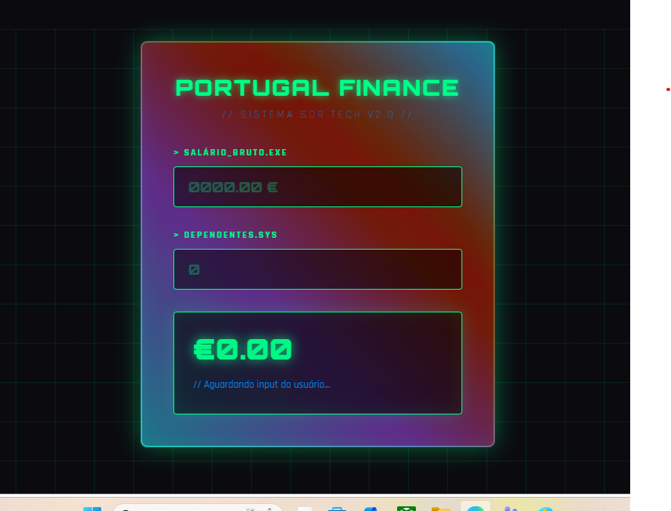

# ⚡ PORTUGAL FINANCE // SISTEMA SDR TECH V2.0

**Calculadora de Salário Líquido PT 2026 com UI Cyberpunk**

### 🔗 **Demo ao vivo:** https://portugal-finance.vercel.app
   

### 🛠️ **Stack:**
- **Frontend:** React + Vite, HTML5, CSS3, JavaScript
- **Design:** Cyberpunk UI, Neon Effects, Grid Layout  
- **Deploy:** Vercel
- **Lógica:** Seg. Social 11% + Tabelas IRS PT 2026 + Dedução por Dependentes

### ✨ **Features:**
1. Cálculo em tempo real de salário líquido
2. Breakdown completo: Bruto → Seg. Social → IRS → Líquido
3. Interface `.EXE` estilo terminal cyberpunk  
4. 100% Responsivo e otimizado

### 💡 **Por que esse projeto?**
Parte do meu Pipeline Bot B2B que gerou 86 reuniões/mês. Prova skill em Frontend, UX/UI e implementação de regras de negócio complexas de Portugal.

### 🧑‍💻 **Lucas Lima - Dev Junior**
[LinkedIn](https://linkedin.com/in/lucas-lima-6b97422b9) | [WhatsApp](https://wa.me/5521988862013) | [GitHub](https://github.com/lucasdevfrontendbr)

**Gostou? Me chama pra uma call. Eu automatizo o pipeline da sua empresa também.**
